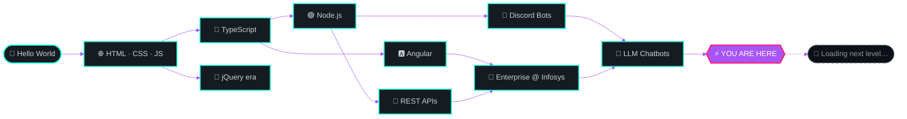

<!-- ════════════════════════════ HEADER ════════════════════════════ -->
<div align="center">


<br/>


<br/><br/>

<a href="https://www.ixender.com"></a>
<a href="https://github.com/Xender007?tab=repositories"></a>
<!-- TODO(Xender007): replace the "#" below with your real profile links -->
<a href="#"></a>
<a href="#"></a>

</div>

<br/>

<!-- ════════════════════════════ CHARACTER SHEET ════════════════════════════ -->

##  &nbsp;`PLAYER_PROFILE.json`

<table>
<tr>
<td width="57%" valign="top">

```jsonc
{
  "handle":  "Xender007",
  "name":    "Suprotim Mukherjee",
  "class":   "Full-Stack Engineer 🧙",
  "guild":   "Infosys",
  "region":  "India 🇮🇳",
  "hq":      "https://www.ixender.com",

  "currently": {
    "building":  "AI chatbots on LLM models 🤖",
    "learning":  "System design + Gen-AI tooling 🧠",
    "exploring": "Angular internals & Node.js 🔬"
  },

  "loadout": ["TypeScript", "Angular",
              "Node.js", "Python"],
  "openTo":  ["collabs", "hackathons",
              "open source", "☕ chats"],

  "funFact": "I ship faster than my tests finish 😄"
}
```

</td>
<td width="43%" valign="top">

<div align="center">

</div>

<br/>

| ⚔️ **STAT** | **LEVEL** |
|:---|:---|
| `Frontend`  | `▰▰▰▰▰▰▰▰▱▱` |
| `Backend`   | `▰▰▰▰▰▰▰▱▱▱` |
| `AI / ML`   | `▰▰▰▰▰▰▱▱▱▱` |
| `DevOps`    | `▰▰▰▰▰▱▱▱▱▱` |
| `Debugging` | `▰▰▰▰▰▰▰▰▰▱` |
| `Coffee ☕` | `▰▰▰▰▰▰▰▰▰▰` |

</td>
</tr>
</table>

<!-- ════════════════════════════ INVENTORY ════════════════════════════ -->

##  &nbsp;`INVENTORY` — Tech Arsenal

<div align="center">

**⚡ LANGUAGES**


**🎨 FRONTEND**


**🛠️ BACKEND &amp; DATA**


**🤖 TOOLS &amp; PLATFORMS**


</div>

<!-- ════════════════════════════ STATS ════════════════════════════ -->

##  &nbsp;`XP & PROGRESSION`

<div align="center">

<picture>
  <source media="(prefers-color-scheme: dark)" srcset="https://github-readme-stats-fast.vercel.app/api?username=Xender007&show_icons=true&hide_border=true&include_all_commits=true&count_private=true&rank_icon=percentile&bg_color=00000000&title_color=00F5D4&icon_color=A855F7&text_color=C9D1D9&ring_color=00F5D4" />
  <source media="(prefers-color-scheme: light)" srcset="https://github-readme-stats-fast.vercel.app/api?username=Xender007&show_icons=true&hide_border=true&include_all_commits=true&count_private=true&rank_icon=percentile&bg_color=00000000&title_color=8B5CF6&icon_color=8B5CF6&text_color=24292F&ring_color=8B5CF6" />
  
</picture>
&nbsp;&nbsp;
<picture>
  <source media="(prefers-color-scheme: dark)" srcset="https://streak-stats.demolab.com?user=Xender007&hide_border=true&background=00000000&ring=00F5D4&fire=F72585&currStreakLabel=00F5D4&currStreakNum=C9D1D9&sideNums=C9D1D9&sideLabels=C9D1D9&dates=6E7681" />
  <source media="(prefers-color-scheme: light)" srcset="https://streak-stats.demolab.com?user=Xender007&hide_border=true&background=00000000&ring=8B5CF6&fire=F72585&currStreakLabel=8B5CF6&currStreakNum=24292F&sideNums=24292F&sideLabels=24292F&dates=57606A" />
  
</picture>

<br/><br/>

<picture>
  <source media="(prefers-color-scheme: dark)" srcset="https://github-readme-stats-fast.vercel.app/api/top-langs/?username=Xender007&layout=compact&hide_border=true&langs_count=10&bg_color=00000000&title_color=00F5D4&text_color=C9D1D9" />
  <source media="(prefers-color-scheme: light)" srcset="https://github-readme-stats-fast.vercel.app/api/top-langs/?username=Xender007&layout=compact&hide_border=true&langs_count=10&bg_color=00000000&title_color=8B5CF6&text_color=24292F" />
  
</picture>
&nbsp;&nbsp;
<picture>
  <source media="(prefers-color-scheme: dark)" srcset="https://github-profile-summary-cards.vercel.app/api/cards/productive-time?username=Xender007&theme=github_dark&utcOffset=5.5" />
  <source media="(prefers-color-scheme: light)" srcset="https://github-profile-summary-cards.vercel.app/api/cards/productive-time?username=Xender007&theme=default&utcOffset=5.5" />
  
</picture>

<br/><br/>


<br/><br/>

<sub><b>🔥 CONTRIBUTION HEATMAP</b></sub>


</div>

<!-- ════════════════════════════ 3D GALAXY ════════════════════════════ -->

##  &nbsp;`CONTRIBUTION GALAXY` — 3D

<div align="center">

<picture>
  <source media="(prefers-color-scheme: dark)" srcset="https://raw.githubusercontent.com/Xender007/Xender007/master/profile-3d-contrib/profile-night-rainbow.svg" />
  <source media="(prefers-color-scheme: light)" srcset="https://raw.githubusercontent.com/Xender007/Xender007/master/profile-3d-contrib/profile-season-animate.svg" />
  
</picture>

<sub>🌌 <i>My entire commit history, rendered as an animated isometric city. Rebuilt daily.</i></sub>

</div>

<!-- ════════════════════════════ SNAKE ════════════════════════════ -->

##  &nbsp;`CONTRIBUTION SNAKE`

<div align="center">

<picture>
  <source media="(prefers-color-scheme: dark)" srcset="https://raw.githubusercontent.com/Xender007/Xender007/output/github-snake-dark.svg" />
  <source media="(prefers-color-scheme: light)" srcset="https://raw.githubusercontent.com/Xender007/Xender007/output/github-snake.svg" />
  
</picture>

<sub>🐍 <i>Watch it devour every commit I've ever made — regenerated automatically every 12 hours.</i></sub>

</div>

<!-- ════════════════════════════ GAME ZONE ════════════════════════════ -->

##  &nbsp;`GAME ZONE` — Actually Playable 🕹️

> **Yes, really.** Everything below runs right here on GitHub. Click the arrows to make your choices.

<br/>

### 🗺️ QUEST I — *Escape the Merge Conflict*

<blockquote>
It's 2:47 AM. You type <code>git pull</code>. The terminal fills with <code>&lt;&lt;&lt;&lt;&lt;&lt;&lt; HEAD</code>.<br/>
<b>47 files. Conflicted.</b> Your deploy is in 13 minutes.<br/><br/>
What do you do?
</blockquote>

<details>
<summary><b>🅰️ &nbsp;<code>git merge --abort</code> and pretend it never happened</b></summary>

<br/>

> You back away slowly. The conflict is gone. So is your teammate's entire day of work.
>
> **Slack, 2:49 AM —** *"hey where'd my commits go 🙂"*

**Choose your defense:**

<details>
<summary>&nbsp;&nbsp;→ &nbsp;<b>"It was like that when I got here"</b></summary>

<br/>

> 💀 **GAME OVER** — `ENDING: THE SCAPEGOAT`
>
> `git blame` is undefeated. It has your name on all 47 lines.
>
> 🏆 **UNLOCKED:** *Reflog Denier*

</details>

<details>
<summary>&nbsp;&nbsp;→ &nbsp;<b>"Hold on — <code>git reflog</code> can save us"</b></summary>

<br/>

> ✨ **VICTORY** — `ENDING: THE TIME TRAVELER`
>
> You resurrect every lost commit in a single command. Your teammate buys you coffee for a week.
>
> 🏆 **UNLOCKED:** *Reflog Wizard* — the rarest achievement in this README

</details>

</details>

<details>
<summary><b>🅱️ &nbsp;Resolve all 47 files by hand, one at a time</b></summary>

<br/>

> You crack your knuckles. File 1 of 47. Then 2. Then 12. Somewhere around file 30 you stop reading the code and start pattern-matching arrows.
>
> ⏰ **11 minutes to deploy.**

**Do you keep going?**

<details>
<summary>&nbsp;&nbsp;→ &nbsp;<b>Accept ALL incoming. Ship it. 🚀</b></summary>

<br/>

> 🔥 **GAME OVER** — `ENDING: THE FRIDAY DEPLOY`
>
> Production is down. The rollback button is greyed out. Your phone is ringing.
>
> 🏆 **UNLOCKED:** *Ship It And See*

</details>

<details>
<summary>&nbsp;&nbsp;→ &nbsp;<b>Push the deploy back and do it properly</b></summary>

<br/>

> 🌟 **TRUE ENDING** — `ENDING: THE PROFESSIONAL`
>
> You delay by an hour. Nobody dies. The code is correct. You sleep at a reasonable time.
>
> *This is the hardest ending to reach. Most developers never see it.*
>
> 🏆 **UNLOCKED:** *Grown Up*

</details>

</details>

<details>
<summary><b>🅲 &nbsp;Close the laptop. Walk into the sea. 🌊</b></summary>

<br/>

> 🧘 **SECRET ENDING** — `ENDING: TOUCHED GRASS`
>
> The conflict is still there tomorrow. But so are you, and you feel fantastic.
>
> Genuinely the correct answer.
>
> 🏆 **UNLOCKED:** *Work–Life Balance (Mythic)*

</details>

<br/>

---

### 🧠 QUEST II — *The Gauntlet* &nbsp;·&nbsp; 3 questions, no Googling

<details>
<summary><b>❓ &nbsp;Q1 · What does <code>[] + {}</code> evaluate to in JavaScript?</b></summary>

<br/>

> **`"[object Object]"`** — a string.
>
> `[]` coerces to `""`, `{}` coerces to `"[object Object]"`, and `+` concatenates them.
>
> Flip it to `{} + []` in a console and you get `0` instead, because `{}` is parsed as an empty *block*, not an object. JavaScript is a beautiful disaster. ❤️

</details>

<details>
<summary><b>❓ &nbsp;Q2 · Why is <code>0.1 + 0.2 !== 0.3</code>?</b></summary>

<br/>

> **IEEE-754 floating point.** Neither `0.1` nor `0.2` has an exact binary representation, so the sum lands on `0.30000000000000004`.
>
> Fix it by comparing against an epsilon: `Math.abs(a - b) < Number.EPSILON`.

</details>

<details>
<summary><b>❓ &nbsp;Q3 · Why does <code>ExpressionChangedAfterItHasBeenCheckedError</code> only appear in Angular dev mode?</b></summary>

<br/>

> Dev mode runs change detection **twice** per cycle and compares the results. If a value mutates between the two passes, your bindings are unstable — and Angular tells you loudly.
>
> Production runs it once, so the bug goes *silent* but doesn't go *away*. Fix the cause, don't hide it. 🎯

</details>

<div align="center">
<br/>
🎖️ <b>Scored 3/3?</b> You're overqualified — <a href="https://www.ixender.com">let's build something together.</a>
</div>

<br/>

---

### 🌌 QUEST III — *The Skill Tree*



<!-- ════════════════════════════ PROJECTS ════════════════════════════ -->

##  &nbsp;`FEATURED QUESTS`

<div align="center">

<a href="https://github.com/Xender007/xender-discord-bot">
  <picture>
    <source media="(prefers-color-scheme: dark)" srcset="https://github-readme-stats-fast.vercel.app/api/pin/?username=Xender007&repo=xender-discord-bot&hide_border=true&bg_color=00000000&title_color=00F5D4&icon_color=A855F7&text_color=C9D1D9" />
    
  </picture>
</a>
<a href="https://github.com/Xender007/angular-type-writer">
  <picture>
    <source media="(prefers-color-scheme: dark)" srcset="https://github-readme-stats-fast.vercel.app/api/pin/?username=Xender007&repo=angular-type-writer&hide_border=true&bg_color=00000000&title_color=00F5D4&icon_color=A855F7&text_color=C9D1D9" />
    
  </picture>
</a>

<a href="https://github.com/Xender007/chatbot-using-ai-LLM-model">
  <picture>
    <source media="(prefers-color-scheme: dark)" srcset="https://github-readme-stats-fast.vercel.app/api/pin/?username=Xender007&repo=chatbot-using-ai-LLM-model&hide_border=true&bg_color=00000000&title_color=00F5D4&icon_color=A855F7&text_color=C9D1D9" />
    
  </picture>
</a>
<a href="https://github.com/Xender007/reminder-medicine-app">
  <picture>
    <source media="(prefers-color-scheme: dark)" srcset="https://github-readme-stats-fast.vercel.app/api/pin/?username=Xender007&repo=reminder-medicine-app&hide_border=true&bg_color=00000000&title_color=00F5D4&icon_color=A855F7&text_color=C9D1D9" />
    
  </picture>
</a>

</div>

<br/>

<details>
<summary><b>📦 &nbsp;Open the full repo vault — all 18 repositories</b></summary>

<br/>

| 🎯 Project | 🧬 Stack | 📖 What it is |
|:---|:---|:---|
| [`xender-discord-bot`](https://github.com/Xender007/xender-discord-bot) | `JavaScript` `discord.js` | A Discord bot built to explore Node.js and the Discord API |
| [`angular-type-writer`](https://github.com/Xender007/angular-type-writer) | `TypeScript` `Angular` | Typewriter text-animation component |
| [`chatbot-using-ai-LLM-model`](https://github.com/Xender007/chatbot-using-ai-LLM-model) | `TypeScript` `LLM` | Conversational AI built on an LLM |
| [`chatbot-ai`](https://github.com/Xender007/chatbot-ai) | `TypeScript` | AI chatbot experiments |
| [`reminder-medicine-app`](https://github.com/Xender007/reminder-medicine-app) | `App` | Medication reminder app 💊 |
| [`monopoly-game`](https://github.com/Xender007/monopoly-game) | `Game` | Monopoly, in code 🎲 |
| [`Snake-Game-Reverse-LL-Tutorial`](https://github.com/Xender007/Snake-Game-Reverse-LL-Tutorial) | `DSA` | Snake game that reverses a linked list 🐍 |
| [`Hackathon-UI`](https://github.com/Xender007/Hackathon-UI) · [`hackathon-ui-final`](https://github.com/Xender007/hackathon-ui-final) | `TypeScript` | Hackathon interfaces ⚡ |
| [`SSO-login`](https://github.com/Xender007/SSO-login) | `Lua` | Single sign-on flow 🔐 |
| [`xender-resume`](https://github.com/Xender007/xender-resume) | `TypeScript` | Résumé, but as code 📄 |
| [`Javscript`](https://github.com/Xender007/Javscript) | `CSS` `jQuery` `JSON` | Website built with jQuery and JSON |
| [`Complete-Python-3-Bootcamp`](https://github.com/Xender007/Complete-Python-3-Bootcamp) | `Jupyter` | Python bootcamp coursework 🐍 |

<div align="center"><a href="https://github.com/Xender007?tab=repositories"><b>→ Browse all 18 repositories</b></a></div>

</details>

<!-- ════════════════════════════ BADGES ════════════════════════════ -->

##  &nbsp;`BADGE CABINET`

<div align="center">


<br/><br/>

<sub>My code is preserved in an Arctic vault for 1,000 years.<br/>Archaeologists in the year 3025 will find my <code>// TODO: fix this later</code> comments. 🧊</sub>

</div>

<!-- ════════════════════════════ CONTACT ════════════════════════════ -->

##  &nbsp;`ESTABLISH CONNECTION`

<div align="center">

```console
$ ssh guest@ixender.com
> Connection established. 🟢
> Open to  : collabs · hackathons · open source · good conversations
> Latency  : fast (unless mid-deploy)
```

<br/>

<a href="https://www.ixender.com"></a>
<a href="https://github.com/Xender007"></a>
<!-- TODO(Xender007): drop in your real LinkedIn URL and mailto: address -->
<a href="#"></a>
<a href="#"></a>

<br/><br/>


<br/>

⭐ **If any of this was useful, a star costs nothing and makes my day.**


</div>
